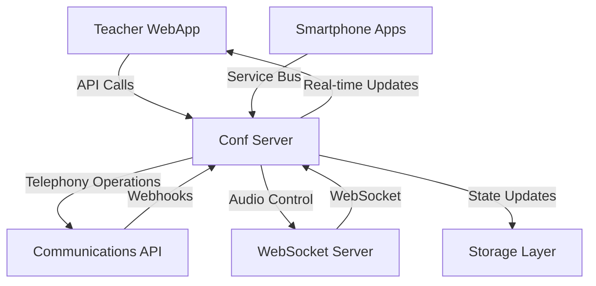

# ConferenceV2 Architecture Documentation

## Overview

ConferenceV2 is a **FastAPI-based conference call orchestration system** that manages telephony conferences between teachers and students for the SEEDS educational platform. The system follows a **clean architecture pattern** with clear separation of concerns and supports real-time communication through multiple channels.

## 📁 Project Structure

```
ConferenceV2/
├── main.py                    # FastAPI application entry point
├── config.py                  # Configuration management
├── conf_logger.py            # Centralized logging setup
├── requirements.txt          # Python dependencies
├── version.txt              # Application version
├── readme.md                # System documentation
├── deploy.sh                # Deployment script
├── private.key              # SSL/TLS certificate
│
├── models/                   # Domain models and data structures
│   ├── conference_call_state.py    # Main conference state model
│   ├── participant.py              # Participant data model
│   ├── action_history.py           # Conference action tracking
│   ├── audio_content_state.py      # Audio playback state
│   ├── system_audio_messages.py    # System audio message URLs
│   ├── webhook_event.py            # External event data model
│   └── ws_service_message.py       # WebSocket message model
│
├── routers/                  # FastAPI route handlers
│   ├── conference.py               # Conference management endpoints
│   ├── webhooks.py                 # External system webhooks
│   └── websocket.py                # WebSocket communication endpoints
│
├── services/                 # Business logic layer
│   ├── conference_call.py          # Core conference management service
│   ├── stream_system_messages.py  # System message streaming
│   ├── vanilla_websocket_service.py # WebSocket service implementation
│   │
│   ├── communication_api/          # Telephony provider abstractions
│   │   ├── base_communication_api.py
│   │   ├── communication_api_factory.py
│   │   ├── vonage_api.py
│   │   └── __init__.py
│   │
│   ├── confevents/                 # Event-driven conference operations
│   │   ├── base_event.py
│   │   ├── add_participant_event.py
│   │   ├── remove_participant_event.py
│   │   ├── mute_participant_event.py
│   │   ├── unmute_participant_event.py
│   │   ├── play_content_event.py
│   │   ├── pause_content_event.py
│   │   ├── resume_content_event.py
│   │   ├── end_conf_event.py
│   │   ├── sink_conf_event.py
│   │   ├── call_status_change_event.py
│   │   ├── dtmf_input_event.py
│   │   ├── mute_all_event.py
│   │   ├── unmute_all_event.py
│   │   ├── playback_state_update_event.py
│   │   ├── reconnect_comm_api_websocket_event.py
│   │   └── vonage/
│   │
│   ├── singletons/                 # Singleton service instances
│   │   ├── conference_call_manager.py
│   │   ├── websocket_service.py
│   │   ├── azure_service_bus_service.py
│   │   └── sas_gen.py
│   │
│   ├── smartphone_connection_manager/  # Mobile app connection management
│   │
│   └── storage_manager/            # Data persistence layer
│       ├── base_storage_manager.py
│       ├── cosmosdb_storage.py
│       ├── mongodb_storage.py
│       └── __init__.py
│
├── schemas/                  # API request/response models
│   └── conference_schemas.py
│
└── tests/                    # Test suite
    ├── test_conference_call.py      # Unit tests for core logic
    └── test_general_call_flow.py    # Integration tests
```

## 🏗️ System Architecture

### High-Level Components

The ConferenceV2 system consists of several key components that work together to provide a comprehensive conference call management solution:

1. **Conf Server** (This codebase) - Central orchestration service
2. **Teacher WebApp** - Frontend interface for teachers
3. **Communications API** - Telephony provider (Vonage)
4. **WebSocket Server** - Audio streaming service
5. **Storage Systems** - Azure Cosmos DB, Service Bus, Blob Storage

### Component Interaction Flow



## 🔧 Core Components

### 1. Application Entry Point (`main.py`)

The FastAPI application with lifecycle management:

```python
@asynccontextmanager
async def lifespan(app: FastAPI):
    # Initialize WebSocket service on startup
    ws = WebsocketService()
    await ws.initialize()
    yield
    # Cleanup on shutdown
    ws.cancel_bg_processes()

app = FastAPI(title="SEEDS Conference Call System", lifespan=lifespan)
```

**Key Features:**
- CORS middleware configuration
- Router registration
- WebSocket service lifecycle management
- Version management from `version.txt`

### 2. API Layer (`routers/`)

#### Conference Router (`routers/conference.py`)
Primary conference management endpoints:

- `POST /conference/create` - Create new conference
- `POST /conference/start/{id}` - Start conference call
- `PUT /conference/end/{id}` - End conference call
- `PUT /conference/addparticipant/{id}` - Add participant
- `PUT /conference/removeparticipant/{id}` - Remove participant
- `PUT /conference/muteparticipant/{id}` - Mute participant
- `PUT /conference/unmuteparticipant/{id}` - Unmute participant
- `POST /conference/teacherappconnect/{id}` - Establish SSE connection

#### Webhooks Router (`routers/webhooks.py`)
External system integration endpoints:

- `POST /webhooks/events/{id}` - Receive call status updates
- `POST /webhooks/conversationevents` - Handle DTMF inputs

### 3. Business Logic Layer (`services/`)

#### Core Conference Service (`conference_call.py`)

The heart of the system managing individual conference instances:

```python
class ConferenceCall:
    def __init__(self, conf_id: str, communication_api: CommunicationAPI, 
                 storage_manager: StorageManager, connection_manager: SmartphoneConnectionManager):
        self.conf_id = conf_id
        self.communication_api = communication_api
        self.storage_manager = storage_manager
        self.connection_manager = connection_manager
        self.state = ConferenceCallState()
        self.event_queue = asyncio.Queue()
```

**Key Responsibilities:**
- Conference state management
- Event queue processing
- Participant management
- System message streaming
- WebSocket callbacks
- Storage operations

#### Event System (`services/confevents/`)

**Event-Driven Architecture** for all conference operations:

**Base Event Pattern:**
```python
class ConferenceEvent(ABC):
    @abstractmethod
    async def execute_event(self):
        pass
```

**Available Events:**
- **Participant Management**: Add, Remove, Mute, Unmute participants
- **Audio Control**: Play, Pause, Resume content
- **Conference Lifecycle**: Start, End, Sink conferences
- **Status Updates**: Call status changes, DTMF inputs
- **System Events**: WebSocket reconnection, playback state updates

#### Singleton Services (`services/singletons/`)

**Conference Call Manager:**
```python
class ConferenceCallManager:
    def __init__(self, communication_api_type, smartphone_connection_manager_type, storage_manager):
        self.conferences: Dict[str, ConferenceCall] = {}
        # Factory patterns for extensibility
```

**Key Features:**
- Multi-conference management
- Factory pattern for communication APIs
- Centralized conference lifecycle
- Resource management

#### Communication API Layer (`services/communication_api/`)

**Factory Pattern** for telephony provider abstraction:

```python
class CommunicationAPI(ABC):
    @abstractmethod
    async def start_conf(self, teacher_phone: str, student_phones: List[str]) -> str:
        pass
    
    @abstractmethod
    async def end_conf(self):
        pass
```

**Current Implementation:**
- **Vonage API** - Production telephony provider
- **Factory Pattern** - Easy provider switching
- **WebSocket Integration** - Real-time communication

#### Storage Layer (`services/storage_manager/`)

**Strategy Pattern** for data persistence:

```python
class StorageManager(ABC):
    @abstractmethod
    async def save_state(self, conf_id: str, state: dict):
        pass
    
    @abstractmethod
    async def load_state(self, conf_id: str) -> dict:
        pass
```

**Available Implementations:**
- **Azure Cosmos DB** - Production storage
- **MongoDB** - Alternative persistent storage
- **Extensible** - Easy to add new storage backends

### 4. Data Models (`models/`)

#### Conference Call State (`conference_call_state.py`)

The central state model containing all conference information:

```python
class ConferenceCallState(BaseModel):
    is_running: bool = Field(default=False)
    teacher_phone_number: str = None
    participants: Dict[str, Participant] = Field(default_factory=dict)
    audio_content_state: AudioContentState = AudioContentState()
    action_history: List[ActionHistory] = Field(default_factory=list)
    
    def get_teacher(self) -> Optional[Participant]:
        # Returns teacher participant
    
    def get_students(self) -> List[Participant]:
        # Returns all student participants
```

#### Participant Model (`participant.py`)

Individual participant representation:

```python
class Participant(BaseModel):
    name: str
    phone_number: str
    role: Role  # TEACHER or STUDENT
    raised_at: int = Field(default=-1)
    is_raised: bool = Field(default=False)
    is_muted: bool = Field(default=False)
    call_status: CallStatus = Field(default=CallStatus.DISCONNECTED)
```

#### Action History (`action_history.py`)

Conference action tracking for audit and state management:

```python
class ActionHistory(BaseModel):
    timestamp: str
    action_type: ActionType
    metadata: Dict
    owner: str  # Phone number of action performer
```

**Action Types:**
- Conference lifecycle: CREATED, START_REQUESTED, START, START_FAILED, END, SINK
- Participant management: ADD, REMOVE, MUTE, UNMUTE
- Audio control: PLAYBACK_STATUS_CHANGE
- System events: CALL_STATUS_CHANGE, RAISE_HAND

## 🔄 Key Design Patterns

### 1. Event-Driven Architecture

All conference operations are implemented as asynchronous events:

```python
# Event creation and queuing
event = MuteParticipantEvent(conf_id, phone_number)
await conference_call.queue_event(event)

# Asynchronous processing with timeout handling
async def __process_conf_events_queue(self, timeout: float = 3.0):
    while True:
        event = await self.event_queue.get()
        try:
            await asyncio.wait_for(event.execute_event(), timeout=timeout)
        except asyncio.TimeoutError:
            logger.info(f"Event {event} execution timed out")
        except Exception as e:
            logger.error(f"Error executing event {event}: {e}")
```

**Benefits:**
- Asynchronous operation handling
- Error isolation and recovery
- Timeout management
- Complex workflow support

### 2. Factory Pattern

Enables switching between different service providers:

```python
class CommunicationAPIFactory:
    def create(self, api_type: CommunicationAPIType) -> CommunicationAPI:
        if api_type == CommunicationAPIType.VONAGE:
            return VonageAPI()
        # Easy to add new providers
```

### 3. Strategy Pattern

Flexible storage and connection management:

```python
# Storage backend selected via STORAGE_BACKEND env var
storage_manager = CosmosDBStorage() if backend == "cosmos" else MongoDBStorage()

# Communication APIs can be switched
comm_api = factory.create(CommunicationAPIType.VONAGE)
```

### 4. Singleton Pattern

Ensures single instances for resource management:

```python
# Global conference manager
conference_manager = ConferenceCallManager(...)

# Global WebSocket service
websocket_service = WebsocketService()
```

## 🚀 Data Flow Architecture

### Conference Creation and Management Flow

```
1. Teacher WebApp → POST /conference/create
   ↓
2. ConferenceCallManager.create_conference()
   ↓
3. ConferenceCall created → CONFERENCE_CREATED written to MongoDB
   ↓
4. Conference ID returned to Teacher WebApp
   ↓
5. Teacher WebApp → POST /conference/start/{id}
   ↓
6. CONFERENCE_START_REQUESTED written to MongoDB (before Vonage call)
   ↓
7. CommunicationAPI.start_conf() called (Vonage)
   ↓
8. CONFERENCE_START written to MongoDB; state updates pushed via SSE
   (on failure: CONFERENCE_START_FAILED written to MongoDB)
```

### Event Processing Flow

```
API Request → Event Creation → Event Queue → Async Processing → State Update → Notifications
     ↓              ↓              ↓              ↓              ↓              ↓
Conference     AddParticipant   Queue.put()   execute_event() StorageManager  SSE + Service Bus
 Router           Event                                           .save_state()
```

### Real-time Communication Flow

```
Webhooks (Status Updates) → ConferenceCall → State Update → SSE/Service Bus → Frontend/Mobile
     ↑                           ↓                ↓              ↓
Communications API        Event Processing   Storage Layer   Real-time Updates
```

## 🔧 Configuration Management

### Environment Configuration (`config.py`)

```python
class Settings(BaseSettings):
    VONAGE_API_KEY: str
    VONAGE_API_SECRET: str
    STORAGE_BACKEND: str = "mongodb"   # "mongodb" | "cosmos"
    MONGO_DB_CONNECTION_STRING: str
    MONGO_COLLECTION_NAME: str = "conferenceState"
    COSMOS_ENDPOINT: str
    COSMOS_KEY: str
    WS_SERVER_EP: str
    EVENTS_WEBHOOK_EP: str
    SERVICE_BUS_NS_NAME: str
    SERVICE_BUS_TOPIC_NAME: str
```

### Logging Configuration (`conf_logger.py`)

Centralized logging with Azure Application Insights integration for production monitoring and debugging.

## 🌐 External Integrations

### 1. Vonage Communication API
- **Telephony Services**: Call creation, merging, management
- **WebSocket Integration**: Real-time audio streaming
- **Webhook Endpoints**: Call status updates and DTMF inputs

### 2. Azure Services
- **Cosmos DB**: Optional conference state backend (`STORAGE_BACKEND=cosmos`)
- **Service Bus**: Real-time messaging to mobile apps
- **Blob Storage**: Audio content storage and streaming
- **Application Insights**: Logging and monitoring

### 3. WebSocket Server
- **Audio Streaming**: Direct audio content injection
- **Playback Control**: Play, pause, resume operations
- **Status Updates**: Real-time playback state changes

## 🧪 Testing Architecture

### Test Structure

```
tests/
├── test_conference_call.py      # Unit tests (100% coverage)
└── test_general_call_flow.py    # Integration tests
```

### Testing Approach

**Unit Tests (`test_conference_call.py`):**
- **Mock-based testing** for all external dependencies
- **Parametrized tests** for multiple scenarios
- **Async/await support** using pytest-asyncio
- **Event processing testing** with custom mock events
- **Error condition testing** for robustness

**Integration Tests (`test_general_call_flow.py`):**
- **End-to-end API testing** using TestClient
- **Real Azure Service Bus integration**
- **Complete workflow validation**
- **Background process testing**

### Key Testing Features

```python
# Consolidated fixtures for efficiency
@pytest.fixture
def mock_services():
    """Single fixture providing all mocked services"""
    return communication_api, storage_manager, connection_manager

# Parameterized testing for multiple scenarios
@pytest.mark.parametrize("is_running,websocket_connected,should_stream", [
    (True, True, True),
    (True, False, False),
    (False, True, False),
])
async def test_stream_system_message(self, conference_call, is_running, websocket_connected, should_stream):
    # Test logic here
```

## 🔐 Security and Reliability Features

### 1. Error Handling
- **Timeout management** for event processing
- **Exception isolation** in event queue
- **Graceful degradation** for external service failures
- **Comprehensive logging** for debugging

### 2. Resource Management
- **WebSocket connection pooling**
- **Async context managers** for lifecycle management
- **Background task cleanup** on application shutdown

### 3. State Management
- **Consistent state persistence** across operations
- **Action history tracking** for audit trails
- **Real-time state synchronization** across clients

## 📈 Scalability Considerations

### 1. Asynchronous Processing
- **Event-driven architecture** prevents blocking operations
- **Queue-based processing** handles load spikes
- **Background task management** for long-running operations

### 2. Service Abstraction
- **Factory patterns** enable provider switching
- **Strategy patterns** allow storage scaling
- **Singleton management** controls resource usage

### 3. Monitoring and Observability
- **Structured logging** throughout the application
- **Azure Application Insights** integration
- **Performance metrics** tracking
- **Error rate monitoring**

## 🚀 Deployment and Operations

### Deployment Script (`deploy.sh`)
Automated deployment script for production environments.

### Version Management (`version.txt`)
Semantic versioning for release tracking and API documentation.

### SSL/TLS Configuration (`private.key`)
Security certificate management for HTTPS endpoints.

## 🔮 Future Extensibility

The architecture is designed for easy extension:

1. **New Communication Providers**: Implement `CommunicationAPI` interface
2. **Additional Storage Backends**: Implement `StorageManager` interface  
3. **New Event Types**: Extend `ConferenceEvent` base class
4. **Mobile Platform Support**: Extend connection manager factories
5. **Advanced Audio Features**: Extend audio content state models

This architecture provides a robust, scalable, and maintainable foundation for educational conference call management with comprehensive real-time interaction capabilities.