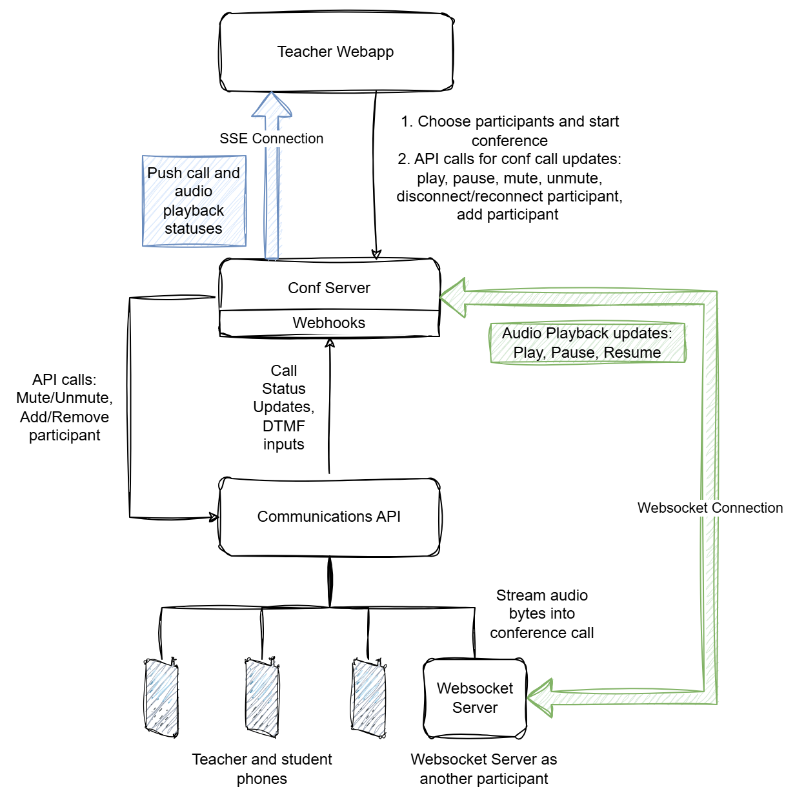
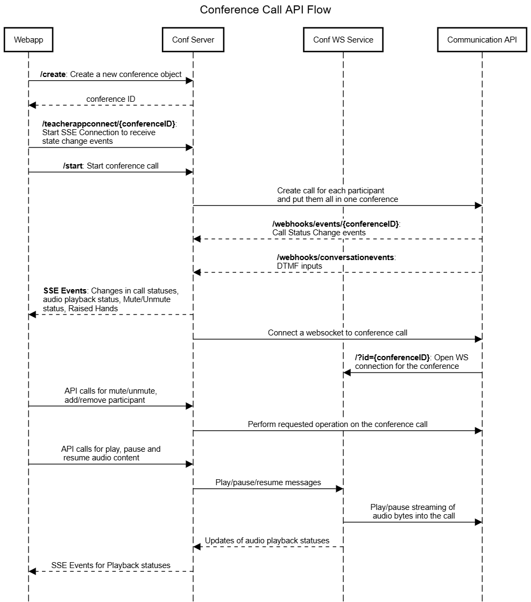

# Conference Call System

This is the **Conference Call System** for SEEDS. Below is the high-level architecture of the system:

The code in this folder is for the **Conf Server**, a FastAPI application responsible for orchestrating conference calls between the teacher and selected students. The **WebSocket Server (Conf WS Service)** is implemented in the `websocket-service` folder of the repository.

---

## Components and Their Roles

1. **Teacher WebApp**

   - A web application for teachers to initiate and manage conference calls.
   - Features include:
     - Selecting participants and starting a conference.
     - Performing operations such as:
       - Playing, pausing, and resuming audio playback.
       - Muting or unmuting participants.
       - Adding, removing, disconnecting, or reconnecting participants.

2. **Conf Server**

   - The central server coordinating the conference.
   - Responsibilities:
     - Processing call status updates and DTMF inputs via **Webhooks**.
     - Sending real-time updates (call status, audio playback status) to the Teacher WebApp using **Server-Sent Events (SSE)**.
     - Communicating with the WebSocket Server for audio playback updates (play, pause, resume).

3. **Communications API**

   - Manages telephony conference calls based on requests from the Conf Server.
   - Handles creating and merging calls for participants.

4. **WebSocket Server**
   - Participates in the conference for streaming audio playback.
   - Streams audio file bytes directly into the conference.
   - Provides real-time updates on audio playback status via **WebSocket connections**.

---

## Key Flows and Interactions

### 1. **Conference Creation**

- The Teacher WebApp sends a `/create` API call to the Conf Server to create a new conference.
- The Conf Server responds with a `conference ID`.

### 2. **State Subscription**

- The Teacher WebApp establishes an SSE connection using `/teacherappconnect/{conferenceID}` to receive state change events from the Conf Server.

### 3. **Starting a Conference**

- The Teacher WebApp calls the `/start` API on the Conf Server to begin the conference.
- The Conf Server requests the Communications API to create calls for participants and merge them into the conference.

### 4. **State Updates**

- The Conf Server receives updates from the Communications API via:
  - `/webhooks/events/{conferenceID}`: For call status changes.
  - `/webhooks/conversationevents`: For DTMF inputs (e.g., keypad commands).
- These updates are pushed to the Teacher WebApp as SSE events.

### 5. **WebSocket Integration**

- The Communications API establishes a WebSocket connection to the conference using the `/?id={conferenceID}` endpoint provided by the WebSocket Server.

### 6. **Playback Controls**

- The Teacher WebApp sends API calls to the Conf Server to control playback (play, pause, resume).
- The Conf Server forwards these instructions to the WebSocket Server, which streams the audio into the conference.

### 7. **Participant Management**

- The Teacher WebApp sends API calls to the Conf Server to:
  - Mute or unmute participants.
  - Add or remove participants.

### 8. **Real-Time Updates**

- The Conf Server sends updates to the Teacher WebApp via:
  - SSE events for audio playback status.
  - SSE events for call statuses, mute/unmute states, and raised hands.

---

## Data Flows

- **SSE Connection**:

  - Real-time updates (call and audio playback statuses) are sent from the Conf Server to the Teacher WebApp.

- **API Calls**:

  - From the Teacher WebApp to the Conf Server for actions such as starting the conference, managing participants, and updating playback status.
  - From the Conf Server to the Communications API to execute participant-related operations (e.g., mute/unmute).

- **WebSocket Connection**:
  - Between the Conf Server and WebSocket Server for managing audio playback.
  - The WebSocket Server streams audio directly into the conference.

---

This documentation outlines the core components, interactions, and data flows within the Conference Call System. The system ensures seamless management of telephony-based conference calls with real-time updates and audio playback capabilities.
